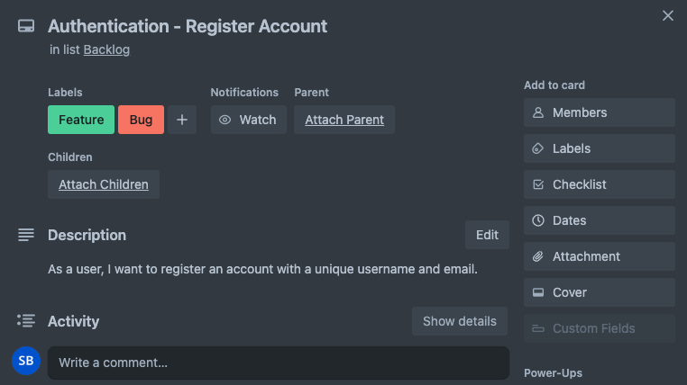

# Trello CSV Data Sync

This project is a Node.js application that synchronizes data from a CSV file with Trello cards. It allows you to update card labels in Trello based on the data in the CSV file.

## Table of Contents

- [Introduction](#introduction)
- [Prerequisites](#prerequisites)
- [Getting Started](#getting-started)
  - [Installation](#installation)
  - [Configuration](#configuration)
- [Usage](#usage)
- [Contributing](#contributing)
- [License](#license)

## Introduction

The Trello CSV Data Sync application simplifies the process of updating Trello cards by automating the synchronization of data from a CSV file. It is especially useful for managing large sets of Trello cards with associated data. This can be generally useful if you are using Trello and wish to automate certain lists.

## Prerequisites

Before you can use this application, make sure you have the following prerequisites installed:

- Node.js: [Installation Guide](https://nodejs.org/)
- Git: [Installation Guide](https://git-scm.com/)

## Getting Started

Follow these steps to get started with the Trello CSV Data Sync application:

### Installation

1. Clone the repository:

   ```bash
   git clone https://github.com/SageBaram/trello-csv-sync.git
   ```

2. Navigate to the project directory:

   ```bash
   cd trello-csv-sync
   ```

3. Install dependencies:

   ```bash
   npm install
   ```

### Configuration

To configure the Trello CSV Data Sync application, follow these steps:

1. Create a `.env` file in the project root directory with the following content:

```
TRELLO_API_KEY=your-trello-api-key
TRELLO_OAUTH_TOKEN=your-trello-oauth-token
LIST_ID=your-trello-list-id
BOARD_ID=your-trello-board-id
```

Replace the placeholders with your actual Trello credentials:

- `your-trello-api-key`: Your Trello API key.
- `your-trello-oauth-token`: Your Trello OAuth token.
- `your-trello-list-id`: The Trello list ID.
- `your-trello-board-id`: The Trello board ID for your project.

2. Save the `.env` file in the project directory. The application will automatically load these environment variables when it runs.

You can obtain your Trello API key and OAuth token from the [Trello Developer Portal](https://developer.atlassian.com/cloud/trello/guides/rest-api/api-introduction/).<br>
You can generate it directly from Trello API: [Accessing Trello API](https://trello.com/power-ups/admin)

<strong>Get your Trello credentials</strong>: 

- Look for the "New" button, and set up the integration.
- To access your board-id, you can go onto the Trello's web application, enter your board and read it's json output by `.json` to the url and submitting a request. The `id` attribute is the board-id.
- To access a list-id, use `CTRL/CMD + F` to search for your list's name inside the board's json output. For example type `"Backlog"` to find the Backlog list. The `id` above is the list-id.


Your configuration is now complete, and you can proceed to use the application as described in the [Usage](#usage) section.

## Usage

To use the Trello CSV Data Sync application, follow these steps:

1. Ensure you have configured the `.env` file as mentioned in the [Configuration](#configuration) section.

2. Place your CSV file with the data to sync in the project directory or specify the correct file path in `config.js`.

3. Run the application:

   ```bash
   npm start
   ```

   The application will read the CSV file, fetch existing Trello cards, and synchronize labels based on the data in the CSV file.

<br>
<strong>CSV File Structure</strong>:

```
HEADERS: Epic Name,User Story,Description,Labels
ROW: [Epic Name],[User Story],"[Description]","[Labels]"
```

- `Epic Name`: The epic name
- `User Story`: The main task
- `Description`: The description (user story structured).
- `Labels`: Card labels.

Sample row below will create the card in the image:

```
Authentication,Register Account,"As a user, I want to register an account with a unique username and email.","Feature,Bug"
```



**NOTE: in order for the labels to update properly, the label name provided in the csv file must match the label name in trello**

## Contributing

If you'd like to contribute to this project, please read our [Contribution Guidelines](CONTRIBUTION.md).

## License

This project is licensed under the MIT License. See the [LICENSE](LICENSE) file for details.
